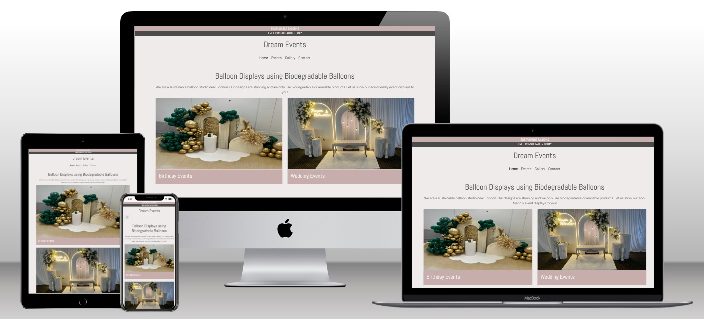

# Dream Events Web Page

## Overview

Dream Events is a dynamic and visually engaging webpage designed to showcase events with a focus on elegance and creativity. It offers users comprehensive information about event types, services, and ways to get in touch. The website is structured across the following pages:
- **Home Page:** A welcoming introduction with key highlights of services and events.
- **Events Page:** A detailed list of events with relevant details.
- **Contact Page:** A contact form for user inquiries.

## Features

1. **Responsive Design:** Adapts seamlessly to various screen sizes and devices for an optimal user experience.
2. **Font Awesome Integration:** Adds modern and visually appealing icons.
3. **Bootstrap Framework:** Ensures responsive grids and interactive elements like cards and navigation.
4. **Interactive Elements:** Includes sections like service highlights, footer information, and event cards.

## Home Page Details

The Home Page is the central hub of the Dream Events website, featuring:
- **Navbar:** A navigation bar for seamless access to all pages.
- **Introduction:** Text describing the premium balloons used for events, adding a touch of magic.
- **Event Highlights:** Two interactive cards showcasing event images and types.
- **Our Services:** A dedicated section describing the variety of services provided, accompanied by relevant images.
- **Footer:** Includes two sections:
  - **About Us:** Brief information about Dream Events.
  - **Contact Info:** Ways to reach out, including email and phone.

## Events Page Details

The **Events Page** provides an in-depth look at the types of events we cater to and the process we follow:

- **Our Events Section:** Outlines the types of events we specialize in, including:
  - Adults Birthday
  - Kids Birthdays
  - Baby Balloons
  - Wedding Balloons
  
- **Our Process Section:** Breaks down how we bring your vision to life:
  1. **Contact Us:** Share your event requirements through our contact form or via email.
  2. **Design:** Collaborate with our team to finalise the decor and overall event design.
  3. **Pay:** Make secure payments to confirm your booking.
  4. **Delivery:** We handle the setup and execution, ensuring everything is perfect on your special day.

## Contact Page Details

The **Contact Page** allows visitors to get in touch with us through an inquiry form easily. Features include:
- **Contact Inquiry Form:**
  - Name input field.
  - Email input field.
  - Message text area for inquiries.
- **Additional Contact Information:**
  - Phone number.
  - Email address.
  - Physical address (if applicable).

The form is styled using Bootstrap components and includes validation to ensure complete and accurate submissions.

## Technologies Used

- **HTML5**: For structuring the webpage content.
- **CSS3**: For styling and enhancing the visual appeal.
- **Bootstrap**: For responsive design and pre-built components.
- **Font Awesome**: For modern and professional-looking icons.
- **JavaScript**: For dynamic and interactive functionality.

## Setup and Installation

## Testing
-   Accessibility
    -   I ran the pages through Lighthouse and confirmed that the colors and fonts are easy to read and that the site is accessible.
    
    
 
-   I tested and confirmed that the page works in different browsers; Chrome, Safari and Firefox.
-   I tested and confirmed that all internal links are working and redirecting the user between the pages.
-   I tested that all external links, to social media sites, are woking and opening in a separate tab.
-   I tested and confirmed that the contact form works, all fields are required, the radio buttons are required (one of them), the email field only accepts email address, and the submit button link works:

-   HTML
    -   No errors found when running the code through the [W3C HTML Validator](https://validator.w3.org/)

-   CSS
    -   No errors found when running the code through the [W3C CSS Validator](https://jigsaw.w3.org/css-validator/) 
    

## Deployment

### Version Control
-   The site was created using Gitpod editor and pushed to Github to the remote repository 'optimal_health'.
-   Git commands were used throughout the development to push the code to the remote repository. The following git commands were used:
    -   git add . - to add the files to the staging area before being committed.
    -   git commit -m "commit message" - to commit changes to the local repository queue that are ready for the final step.
    -   git push - to push all committed code to the remote repository on Github.

### Deployment to Github pages
-   The site was deployed to Github pages as follows:
    -   In the Github repository, I navigated to Settings tab
    -   From the source section drop-down menu, I selected the Master branch and Save
    -   Once the Master branch was selected, the page provided the link to the website
-   The live link: [Dream Events](https://saeed-l5.github.io/dream-events/)

### Cloning of the Repository Code locally
-   Go to the Github repository that you want to clone
-   Click on the Code button located above all the project files
-   Click on HTTPS and copy the repository link
-   Open the IDE of your choice and and paste the copied git url into the IDE terminal
-   The project is now created as a local clone
